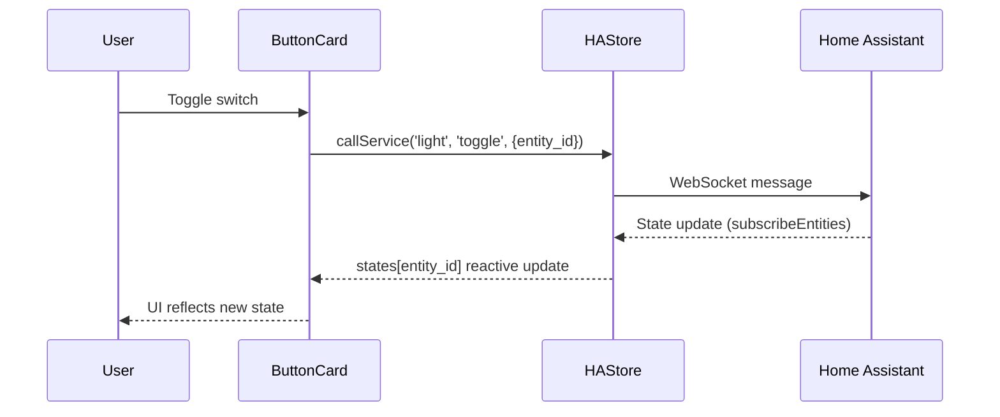
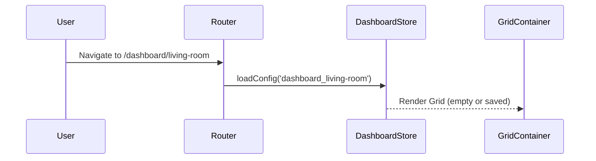

# Architecture Overview

**Last Updated**: May 14, 2026

A Material Design 3 dashboard for Home Assistant built with **Svelte 5** and **SvelteKit**.

---

## Tech Stack

| Layer | Technology |
|-------|-----------|
| Framework | [Svelte 5](https://svelte.dev) with runes (`$state`, `$derived`, `$effect`) |
| Routing | [SvelteKit](https://kit.svelte.dev) |
| Styling | [Tailwind CSS 4](https://tailwindcss.com) |
| Theming | [Material Color Utilities](https://github.com/material-foundation/material-color-utilities) |
| HA Integration | [home-assistant-js-websocket](https://github.com/home-assistant/home-assistant-js-websocket) |
| Testing | [Vitest](https://vitest.dev) + [@testing-library/svelte](https://testing-library.com/svelte) |
| Icons | [Iconify](https://iconify.design) via unplugin-icons |
| Validation | [Zod](https://zod.dev) (Schema validation) |
| Error Handling | [Monadic Result](src/lib/utils/result.ts) (Safe error propagation) |
| Data Viz | [D3.js](https://d3js.org) (Graphs) |
| Maps | [Leaflet](https://leafletjs.com) (Radar) |

---

## Running in Production

To ensure all configurations (like upload limits) are applied correctly, always start the application using the custom server entry point:

```bash
npm start
# OR
node server.js
```

Runtime dashboard state is intentionally kept outside the git checkout. In the self-hosted Docker deployment, `/app/data` should be mounted from a persistent server directory such as `/srv/ha-dashboard/data`, configured through `DASHBOARD_DATA_DIR`. The live `config.json` and uploaded images belong in that mounted directory; git tracks only `data/config.example.json` as a sanitized starter.

For same-origin API protection, set `DASHBOARD_ORIGIN` to the exact URL used in the browser, for example:

```bash
DASHBOARD_DATA_DIR=/srv/ha-dashboard/data
DASHBOARD_ORIGIN=http://192.168.0.113:3000
```

---

## Project Structure

```
src/
├── app.css              # Global styles & Tailwind config
├── app.html             # HTML template
├── hooks.server.ts      # Security headers (CSP, X-Frame-Options)
├── lib/
│   ├── index.ts         # Public exports barrel
│   ├── components/
│   │   ├── md3/         # Material Design 3 primitives
│   │   ├── common/      # Shared utilities (DynamicIcon, IconPicker)
│   │   ├── layout/      # Page shells, grid system, error boundaries
│   │   ├── settings/    # Settings page components
│   │   ├── viz/         # Data visualization (MiniChart)
│   │   └── weather/     # Weather display components
│   ├── features/
│   │   ├── dashboard/   # Dashboard feature (cards, stores)
│   │   │   ├── components/cards/  # Entity cards
│   │   │   ├── stores/  # Dashboard-specific stores
│   │   │   └── utils/   # Layout utilities (gridUtils, gridNavigation)
│   │   ├── music/       # Music Assistant integration
│   │   │   ├── components/  # Music browser, player
│   │   │   └── stores/  # Music-specific stores
│   │   ├── lockscreen/  # Lockscreen feature
│   │   │   ├── components/  # Lockscreen component
│   │   │   └── stores/      # Lockscreen state
│   │   └── calendar/    # Calendar feature
│   │       └── stores/      # Calendar sync state
│   ├── stores/          # Static global stores (HA, Registry, Theme)
│   ├── types/           # TypeScript interfaces (re-exported)
│   ├── domain/          # Pure domain logic & services
│   ├── server/          # Server-side utilities
│   ├── actions/         # Svelte actions
│   └── utils/           # Helper functions
├── routes/
│   ├── +layout.svelte   # Root layout with NavigationRail
│   ├── dashboard/       # Main control dashboard
│   ├── library/         # Component showcase
│   ├── settings/        # HA connection config
│   ├── weather/         # Weather dashboard
│   └── theme/           # Theme customization
└── tests/               # Test setup & utilities
```

---

## Component Hierarchy

```mermaid
graph TD
        A[+layout.svelte] --> B[NavigationRail]
        A --> C[CardConfigDialog]
        A --> D[PageShell]
        D --> NH[NavigationHub]
        D --> GC[GridContainer]
    end

    subgraph MD3 Primitives
        E[Button]
        F[Card]
        G[TextField]
        H[Switch]
        I[Checkbox]
        J[Radio]
        K[Chip]
        L[FAB]
    end

    subgraph Entity Cards
        M[ButtonCard] --> E
        M --> H
        N[MediaCard] --> F
    end

    subgraph Layout Components
        D --> O[ErrorBoundary]
    end
```

### MD3 Primitives (`src/lib/components/md3/`)

Reusable Material Design 3 components with full theming support:

- **Button** — filled, tonal, outlined, text, elevated variants
- **Card** — elevated, filled, outlined variants
- **TextField** — with validation and helper text
- **Switch, Checkbox, Radio** — form controls
- **Chip** — filter and action chips
- **FAB** — floating action button

### Entity Cards (`src/lib/features/dashboard/components/cards/`)

Home Assistant entity control cards:

- **ButtonCard** — switch/slider variants for lights, fans, switches
- **MediaCard** — standard, poster, condensed variants for media players
- **ThermostatCard** — climate control with history graph, supports secondary outdoor sensor
- **TitleCard** — section headers with optional subtitle and alignment
- **TabCard** — nested grid container with tabbed navigation
- **GraphCard** — entity history visualization with configurable aggregation
- **NavigationCard** — navigation links with optional entity shortcuts

### Music Components (`src/lib/features/music/components/`)

- **MusicBrowser** — Full-screen media browser with search and drill-down support.
- **MusicNowPlaying** — Expanded player view with queue and controls.
- **MusicMiniPlayer** — Persistent bottom bar player.
- **MusicPlayerSelector** — Player selection dropdown.
- **MusicSearch** — Global music search functionality.


### Layout (`src/lib/components/layout/`)

- **PageShell** — consistent page wrapper with title
- **GridContainer/GridItem** — CSS Grid-based dashboard layout engine
- **ErrorBoundary** — graceful error handling

---

## State Management

All stores use Svelte 5 runes for fine-grained reactivity:

### HA Integration Layer

The "God Object" HAStore has been decomposed into specialized, decoupled modules adhering to the Single Responsibility Principle:

- **HAAuthService** (`src/lib/domain/haAuthService.ts`) — Encapsulates OAuth and token refresh logic.
- **HARegistryStore** (`src/lib/stores/haRegistry.svelte.ts`) — Manages areas, floors, and entity registry metadata.
- **HAStore** (`src/lib/stores/ha.svelte.ts`) — Unified reactive interface for states and service calls.
- **StorageProvider** (`src/lib/utils/storageProvider.ts`) — Abstracted persistence for tokens and session data.
- **HistoryService** (`src/lib/domain/historyService.ts`) — Pure logic for transforming raw HA history into graphable data.

### WeatherStore (`src/lib/stores/weather.svelte.ts`)

Manages weather data fetching (HA integration), caching, and normalization with background polling:

```typescript
class WeatherStore {
    data = $state<WeatherData | null>(null);
    loading = $state(false);
    
    fetch(force?); // Fetches from HA weather entities
    getIconUrl(code, isDay, isDark); // Maps WMO codes to assets
    // Features: Throttling (30m), Zod-validated response schemas
}
```

### Music Assistant Integration

Native integration with Music Assistant via Home Assistant WebSocket:

- **MAStore** (`src/lib/features/music/stores/maStore.svelte.ts`) — Main integration logic.
    - Handles discovery and connection to `mass` or `music_assistant` domains.
    - Manages player state (players, queues, now playing).
    - Proxies library searching and browsing.
- **MusicLibraryStore** (`src/lib/features/music/stores/musicLibrary.svelte.ts`) — Frontend view state.
    - Manages local favorites independent of MA backend.
    - Handles search results and browsing stack.

### Feature Stores (Lockscreen & Calendar)

Specialized features with independent state management:

- **LockScreenStore** (`src/lib/features/lockscreen/stores/lockscreen.svelte.ts`) — Manages idle timeout, lock state, and background imagery.
- **CalendarStore** (`src/lib/features/calendar/stores/calendar.svelte.ts`) — Syncs and aggregates upcoming events from multiple HA calendar entities.


### ThemeStore (`src/lib/stores/theme.svelte.ts`)

Dynamic MD3 theming with CSS custom properties and server persistence:

```typescript
class ThemeStore {
    sourceColor = $state('#6750A4');
    isDark = $state(false);
    theme = $derived.by(() => themeFromSourceColor(argbFromHex(this.sourceColor)));
    
    init(config);              // Load from server on page load
    toggleDark();              // Toggle + persist
    setSourceColor(color);     // Update + persist
    private applyToDocument(); // Sets --color-m3-* CSS variables
}
```

**Persistence**: localStorage (immediate) + server sync (2s debounce)

### CardEditorStore (`src/lib/features/dashboard/stores/cardEditor.svelte.ts`)

Dialog state for card configuration.

### DashboardEditorStore (`src/lib/features/dashboard/stores/dashboardEditor.svelte.ts`)

Manages the edit mode for dashboard customization, leveraging specialized managers for layout logic.

### DashboardStore (`src/lib/features/dashboard/stores/dashboard.svelte.ts`)

Manages grid configurations, layout persistence, and responsive breakpoints:

```typescript
class DashboardStore {
    config = $state<RoomDashboardConfig | null>(null);
    savedConfigs = $state<Record<string, RoomDashboardConfig>>({});
    pages = $state<DashboardPage[]>([]);
    
    init(configs, pages);  // Load from server on page load
    setConfig(config);     // Save + persist changes
    addPage(name, path);   // Add custom dashboard route
    persistChanges();      // localStorage (immediate) + server (debounced)
}
```

**Persistence Strategy**:
- **Server**: Source of truth (`/api/settings` → `./data/config.json`)
- **localStorage**: Fast caching for instant local updates
- **Debounced sync**: 2-second delay prevents excessive server writes


---

## Routing

| Route | Purpose |
|-------|---------|
| `/` | Landing / redirect |
| `/dashboard` | Main control interface (Home) |
| `/dashboard/[[floor]]/[[room]]` | Dynamic floor & room dashboards |
| `/library` | Component showcase |
| `/settings` | Home Assistant connection |
| `/theme` | Theme builder |
| `/weather` | Weather dashboard & Rain radar |
| `/api/ha-proxy` | Secure generic proxy for HA resources (images/icons) |
| `/ha-history` | Proxy for Home Assistant history API |

---

## Security

Security measures implemented in `hooks.server.ts`:

| Header | Value |
|--------|-------|
| Content-Security-Policy | Strict CSP with required exceptions |
| X-Content-Type-Options | `nosniff` |
| X-Frame-Options | `DENY` |
| Referrer-Policy | `strict-origin-when-cross-origin` |
| Permissions-Policy | Restricts geolocation, microphone, camera |

Additional hardening:
- HTTPS default for HA connections
- Input validation on host/port fields
- Rate limiting (debounce) on service calls
- No XSS-prone patterns (`innerHTML`, `@html`, `eval`)

See [securityrisks.md](./securityrisks.md) for the full security audit.

---

## Testing

Test infrastructure using Vitest with Testing Library:

```bash
npm test        # Run tests in watch mode
npm test -- --run --coverage  # Run with coverage
```

### Coverage

All components have corresponding `.test.ts` files:

- `src/lib/components/md3/*.test.ts` — MD3 primitives
- `src/lib/components/cards/*.test.ts` — Entity cards
- `src/lib/components/layout/*.test.ts` — Layout components
- `src/lib/stores/*.test.ts` — Store unit tests
- `src/lib/utils/*.test.ts` — Utility functions

---

## Data Flow



### Dashboard Loading Flow



```

---

## Adding New Card Types

To maintain type safety and correct board behavior, adding a new card type requires updates in three locations:

### 1. Type Definition (`src/lib/types/dashboard.ts`)
- Update `DashboardCardType` union.
- Update `DashboardItem` with any card-specific properties (use optional types).
- Update `createDefaultItemLayout` with appropriate default `desktopSpan` and `mobileSpan`.

### 2. Editor Mapping (`src/lib/features/dashboard/stores/dashboardEditor.svelte.ts`)
- Update `createItemFromSelection` and `addItem`:
  - Add the type mapping (e.g., `if (itemConfig.type === "new_type") cardType = "new_type";`).
  - Ensure all card-specific properties are passed when creating the `newItem` object.
  - **Failure to map the type will result in the card defaulting to a "button" card.**

### 3. Rendering Logic
- **Card Rendering**: Update `DashboardCardRenderer.svelte` to switch on the new type and render the corresponding component. Root dashboard cards and nested tab cards should use this shared renderer.
- **Config Rendering**: Update `CardConfigSheet.svelte` to show appropriate fields for the new card type and update the preview logic.

---

## Card Library Direction

The `/library` route should stay a polished runtime showcase, not a roadmap board. It should render finished MD3-native card examples with realistic Home Assistant data, empty states, and compact/wide layout checks.

Reference projects are used for product patterns only:

- Mushroom and Button Card: entity tiles, sub-actions, state-aware controls.
- Mini Media Player: compact playback, source, grouping, and volume patterns.
- Mini Graph and ApexCharts: graph presets and multi-series data surfaces.
- Bubble Card: section navigation, room actions, and mobile-first controls.
- Auto Entities: dynamic collections such as active lights, low batteries, unavailable devices, and updates.
- Power Flow Plus: energy flow and daily usage summaries.
- Calendar Card Pro and Atomic Calendar Revive: agenda and family calendar surfaces.
- Universal Remote and Vacuum Card: specialist control panels.

Build order remains reuse-first: extend Button, Media, Graph, Navigation, and Tab behavior where possible, then add specialist card types only for distinct jobs.

---

## Perfect Project Standards

1. **Domain-Driven Design (DDD)** — Complex logic is extracted from stores into pure, testable domain services.
2. **Type Sovereignty** — Use of `Zod` schemas at all data boundaries (APIs, LocalStorage).
3. **Monadic Error Handling** — Consistent use of the `Result` type to prevent swallowed exceptions.
4. **Fine-Grained Reactivity** — Pure Svelte 5 Runes architecture for predictable state updates.
5. **Decoupled Architecture** — Singleton stores are decomposed into specialized modules to avoid God Objects.

---

## Key Design Decisions

1. **Svelte 5 Runes** — Fine-grained reactivity without stores boilerplate
2. **Class-based Stores** — Encapsulated state with methods, exported as singletons
3. **MD3 Dynamic Theming** — Real-time theme generation from any source color
4. **Component-First Architecture** — Reusable MD3 primitives composed into entity cards
5. **CSP-First Security** — Strict Content Security Policy from day one
