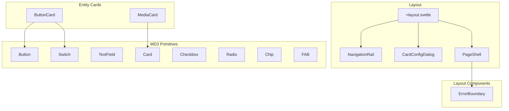
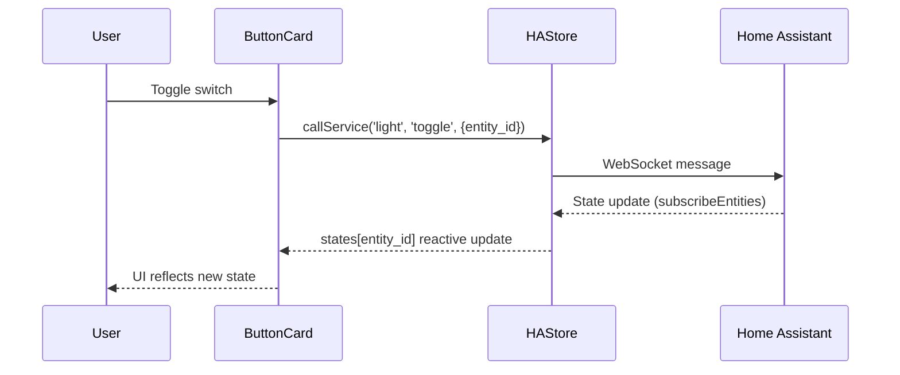

# Architecture Overview

**Last Updated**: January 3, 2026

A Material Design 3 dashboard for Home Assistant built with **Svelte 5** and **SvelteKit**.

---

## Tech Stack

| Layer | Technology |
|-------|-----------|
| Framework | [Svelte 5](https://svelte.dev) with runes (`$state`, `$derived`, `$effect`) |
| Routing | [SvelteKit](https://kit.svelte.dev) |
| Styling | [Tailwind CSS 4](https://tailwindcss.com) |
| Theming | [Material Color Utilities](https://github.com/material-foundation/material-color-utilities) |
| HA Integration | [home-assistant-js-websocket](https://github.com/home-assistant/home-assistant-js-websocket) |
| Testing | [Vitest](https://vitest.dev) + [@testing-library/svelte](https://testing-library.com/svelte) |
| Icons | [Iconify](https://iconify.design) via unplugin-icons |
| Data Viz | [D3.js](https://d3js.org) (Graphs) |
| Maps | [Leaflet](https://leafletjs.com) (Radar) |

---

## Project Structure

```
src/
├── app.css              # Global styles & Tailwind config
├── app.html             # HTML template
├── hooks.server.ts      # Security headers (CSP, X-Frame-Options)
├── lib/
│   ├── index.ts         # Public exports barrel
│   ├── components/
│   │   ├── md3/         # Material Design 3 primitives
│   │   ├── cards/       # Entity cards (Button, Media)
│   │   └── layout/      # Page shells, error boundaries
│   ├── stores/          # Svelte 5 rune-based stores
│   ├── types/           # TypeScript interfaces
│   └── utils/           # Helper functions
├── routes/
│   ├── +layout.svelte   # Root layout with NavigationRail
│   ├── dashboard/       # Main control dashboard
│   ├── library/         # Component showcase
│   ├── settings/        # HA connection config
│   └── theme/           # Theme customization
└── tests/               # Test setup & utilities
```

---

## Component Hierarchy



### MD3 Primitives (`src/lib/components/md3/`)

Reusable Material Design 3 components with full theming support:

- **Button** — filled, tonal, outlined, text, elevated variants
- **Card** — elevated, filled, outlined variants
- **TextField** — with validation and helper text
- **Switch, Checkbox, Radio** — form controls
- **Chip** — filter and action chips
- **FAB** — floating action button

### Entity Cards (`src/lib/components/cards/`)

Home Assistant entity control cards:

- **ButtonCard** — switch/slider variants for lights, fans, switches
- **MediaCard** — standard, poster, condensed variants for media players
- **ThermostatCard** — climate control with history graph, supports secondary outdoor sensor

### Layout (`src/lib/components/layout/`)

- **PageShell** — consistent page wrapper with title
- **ErrorBoundary** — graceful error handling

---

## State Management

All stores use Svelte 5 runes for fine-grained reactivity:

### HAStore (`src/lib/stores/ha.svelte.ts`)

Manages Home Assistant connection and entity state:

```typescript
class HAStore {
    connection = $state<Connection | null>(null);
    states = $state<HassEntities>({});
    connected = $derived(!!this.connection);
    
    async login(host, port);
    async connect(auth);
    async disconnect();
    getEntity(entityId);
    callService(domain, service, data);
}
```

### WeatherStore (`src/lib/stores/weather.svelte.ts`)
    
Manages weather data fetching (HA integration), caching, and normalization:

```typescript
class WeatherStore {
    data = $state<WeatherData | null>(null);
    loading = $state(false);
    
    fetch(force?); // Fetches from HA weather entities
    getIconUrl(code, isDay, isDark); // Maps WMO codes to assets
    // Features: Throttling (5m), Day/Night calculation, Fallback strategies
}
```

### ThemeStore (`src/lib/stores/theme.svelte.ts`)

Dynamic MD3 theming with CSS custom properties:

```typescript
class ThemeStore {
    sourceColor = $state('#6750A4');
    isDark = $state(false);
    theme = $derived.by(() => themeFromSourceColor(argbFromHex(this.sourceColor)));
    
    async setSourceFromImage(image);
    private applyToDocument();  // Sets --color-m3-* CSS variables
}
```

### CardEditorStore (`src/lib/stores/cardEditor.svelte.ts`)

Dialog state for card configuration:

```typescript
class CardEditorStore {
    isOpen = $state(false);
    config = $state<CardConfig | null>(null);
    
    open(config);
    close();
    save();
}
```

---

## Routing

| Route | Purpose |
|-------|---------|
| `/` | Landing / redirect |
| `/dashboard` | Main control interface |
| `/library` | Component showcase |
| `/settings` | Home Assistant connection |
| `/theme` | Theme builder |
| `/weather` | Weather dashboard & Rain radar |
| `/rain-proxy` | Server-side proxy for Buienradar API |

---

## Security

Security measures implemented in `hooks.server.ts`:

| Header | Value |
|--------|-------|
| Content-Security-Policy | Strict CSP with required exceptions |
| X-Content-Type-Options | `nosniff` |
| X-Frame-Options | `DENY` |
| Referrer-Policy | `strict-origin-when-cross-origin` |
| Permissions-Policy | Restricts geolocation, microphone, camera |

Additional hardening:
- HTTPS default for HA connections
- Input validation on host/port fields
- Rate limiting (debounce) on service calls
- No XSS-prone patterns (`innerHTML`, `@html`, `eval`)

See [securityrisks.md](./securityrisks.md) for the full security audit.

---

## Testing

Test infrastructure using Vitest with Testing Library:

```bash
npm test        # Run tests in watch mode
npm test -- --run --coverage  # Run with coverage
```

### Coverage

All components have corresponding `.test.ts` files:

- `src/lib/components/md3/*.test.ts` — MD3 primitives
- `src/lib/components/cards/*.test.ts` — Entity cards
- `src/lib/components/layout/*.test.ts` — Layout components
- `src/lib/components/*.test.ts` — NavigationRail, CardConfigDialog
- `src/lib/stores/*.test.ts` — Store unit tests
- `src/lib/utils/*.test.ts` — Utility functions

---

## Data Flow



---

## Key Design Decisions

1. **Svelte 5 Runes** — Fine-grained reactivity without stores boilerplate
2. **Class-based Stores** — Encapsulated state with methods, exported as singletons
3. **MD3 Dynamic Theming** — Real-time theme generation from any source color
4. **Component-First Architecture** — Reusable MD3 primitives composed into entity cards
5. **CSP-First Security** — Strict Content Security Policy from day one
